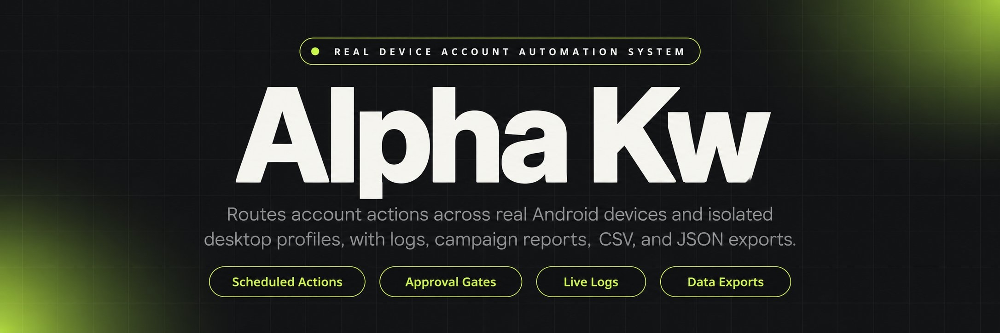
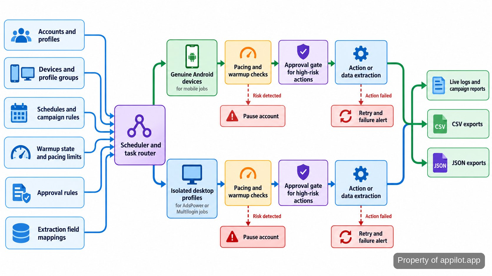

<p align="center">
  <a href="https://www.appilot.app" target="_blank" rel="nofollow">
    
  </a>
</p>

## alpha kw

alpha kw is the repository I use to run multi-account automation across genuine Android devices and isolated desktop profiles. It covers scheduled outreach and engagement, account warmup, mobile app data extraction, and the operator controls around those jobs. The mobile side runs on physical Android hardware, not emulators. The desktop side routes work through fingerprint-isolated profiles in <a href="https://www.adspower.com/" target="_blank" rel="nofollow">AdsPower</a> or <a href="https://multilogin.com/" target="_blank" rel="nofollow">Multilogin</a>.

The system handles work that becomes brittle account by account: profile routing, pacing, risk pauses, failed-job recovery, and centralized output. A dashboard exposes live logs, retries, schedules, and campaign reporting. High-risk account actions can stop at an approval gate instead of running unattended. Those controls make the run observable and governed; they do not make an account ban-proof.

For extraction jobs, app sessions run on genuine Android hardware and produce normalized datasets rather than hand-copied notes. The export layer writes CSV and JSON from repeatable field mappings. <a href="https://www.rfc-editor.org/rfc/rfc4180" target="_blank" rel="nofollow">RFC 4180</a> covers CSV conventions, while <a href="https://www.rfc-editor.org/rfc/rfc8259" target="_blank" rel="nofollow">RFC 8259</a> defines JSON.

<a href="https://www.appilot.app" target="_blank" rel="nofollow">
  
</a>

<p align="center">
  <a href="https://t.me/Bitbash333" target="_blank" rel="nofollow">
    
  </a>&nbsp;
  <a href="https://wa.me/923249868488?text=Hi%2C%20I%27m%20interested." target="_blank" rel="nofollow">
    
  </a>&nbsp;
  <a href="mailto:hello@appilot.app" target="_blank" rel="nofollow">
    
  </a>&nbsp;
  <a href="https://www.appilot.app" target="_blank" rel="nofollow">
    
  </a>
</p>

## Core Features

| Feature | Description |
| --- | --- |
| Physical device fleet control | Manual device-by-device work does not hold up once schedules overlap. The fleet layer provisions and remotely manages genuine Android phones from one operating view, with no emulator path in the mobile workflow. |
| Scheduled account actions | Operators otherwise have to remember when each profile should act. Jobs can schedule outreach, engagement, posting, and other account actions, with queues, rate limits, and warmup-aware pacing around them. |
| Profile-routed desktop tasks | A browser session can become unsafe if profiles bleed into one another. Desktop jobs route by profile group through API-native integrations for AdsPower and Multilogin, with session hygiene and humanized timing controls. |
| Mobile app extraction | Copying fields from app screens by hand is slow and inconsistent. Instrumented app sessions collect the required fields on real devices, then map and normalize them into structured exports. |
| Warmup playbooks and risk pauses | A new or fragile account should not be treated like a mature one. Staged warmup rules pair devices and profiles, track health, and can pause work when configured risk conditions appear. |
| Logs, retries, and alerts | Silent failure is expensive when many accounts run overnight. The operator dashboard keeps live logs, retry handling, failure alerts, and campaign reporting together so a failed step is visible instead of disappearing. |

## The Run From Input to Output

Each run starts with three kinds of operating input: the accounts or profiles involved, the devices or desktop profile groups available to them, and the schedule or campaign rules that decide what should happen. Warmup state, pacing limits, approval requirements, and extraction field mappings sit beside those inputs. The scheduler then routes work to the matching execution surface: a genuine Android device for mobile activity, or an isolated desktop profile for browser work.

Before an action runs, the controls that matter to that account are applied. A warmup-aware queue can slow the sequence; a high-risk action can wait for approval; a health rule can pause the account instead of continuing. Failures enter the retry and alert path rather than being treated as completed work. For HTTP-style rate limiting, the semantics of status code 429 are defined in <a href="https://www.rfc-editor.org/rfc/rfc6585" target="_blank" rel="nofollow">RFC 6585</a>.

The run ends in two families of output. Operational jobs leave logs and campaign reporting for the operator. Extraction jobs leave normalized CSV or JSON that can be handed to a warehouse or downstream process. The picture below is the pipeline as it is operated, not a hidden internal architecture.



## Runtime Components

The stack is easiest to read by responsibility. The mobile layer is genuine <a href="https://developer.android.com/" target="_blank" rel="nofollow">Android hardware</a> with provisioning and remote management around it. The desktop layer uses fingerprint-isolated profiles and API-native profile-manager integration. The scheduler decides when queued work becomes eligible, while routing assigns it to a device or profile group. Pacing, warmup, and approval rules sit in front of account actions.

The observability layer records live logs, retries, and failure alerts. During overnight runs, the operator can see whether work is queued, running, waiting for approval, paused, failed, or retried instead of inferring state from the account. <a href="https://cheatsheetseries.owasp.org/cheatsheets/Logging_Cheat_Sheet.html" target="_blank" rel="nofollow">OWASP's logging guidance</a> is a useful general reference for traceable operational logs.

The extraction path finishes with field mapping and normalization, then writes CSV or JSON. Database, broker, cloud-provider, and language-runtime choices are not operator inputs on this page, so setup stays focused on the components that affect a run: devices, profiles, schedules, controls, logs, and exports.

<a href="https://tally.so/r/yP5oDx?platform=GitHub&amp;format=Product+repo&amp;brand=Appilot&amp;niche=appilot&amp;page=Alpha+KW+on+Android+Hardware&amp;date=2026-09-24" target="_blank" rel="nofollow">
  
</a>

## Project Directory

The repository is arranged around configuration, run entry points, outputs, logs, and operating notes. That keeps account data and campaign rules separate from generated files, and it gives the operator a predictable place to look when a scheduled job behaves differently from a manual test. Source code stays behind the run entry points; these are the surfaces used during routine operation.

```text
automation-project/
├── config/
│   ├── accounts.example.json
│   ├── devices.example.json
│   ├── profiles.example.json
│   ├── schedules.example.json
│   └── field-maps.example.json
├── runbooks/
│   ├── warmup.md
│   ├── account-hygiene.md
│   └── failure-recovery.md
├── scripts/
│   ├── start.sh
│   ├── run-once.sh
│   └── status.sh
├── exports/
│   └── .gitkeep
├── logs/
│   └── .gitkeep
├── .env.example
└── README.md
```

The example configuration files document the shape of the inputs without putting live account credentials into version control. Runbooks cover staged warmup, account hygiene, and failure recovery, because those operating rules are part of keeping repeated runs understandable. Generated exports and logs have their own directories, so a data file is not confused with configuration or source.

## How to Run Multi-Account Automation Using alpha kw

- **STEP 1 - Download & Set Up the Project**  
Download, set up, and install **alpha kw** to get the project running. Copy the example configuration, then add the device, profile, account, schedule, and field-mapping values used by this deployment.
- **STEP 2 - Open the Operator Dashboard**  
Start the repository with its provided run entry point, then open the dashboard to confirm devices, profile groups, queues, live logs, and pending approvals are visible.
- **STEP 3 - Configure the Run**  
Choose the accounts or profiles, assign devices or desktop groups, set schedules, pacing and warmup rules, add approval gates, and select extraction fields when the job collects data.
- **STEP 4 - Trigger and Collect**  
Start the queued run from the operator controls. Watch logs and retries as it executes; collect campaign reporting for account actions or CSV and JSON for extraction jobs.

```bash
cp .env.example .env
./scripts/start.sh
./scripts/status.sh
./scripts/run-once.sh
```

## Use Cases

- **Run scheduled outreach without babysitting every account.** Queue account actions, apply rate limits and warmup-aware pacing, and use the dashboard to see retries or failures when the run continues overnight.
- **Warm profiles before moving them into higher-volume campaigns.** Staged playbooks pair the intended device and profile, track health, and pause activity when a configured risk rule is hit.
- **Extract repeatable datasets from mobile apps.** Real-device sessions collect the defined fields, normalize them, and write CSV or JSON so the next process receives structured rows instead of manual notes.
- **Route desktop work across isolated profile groups.** AdsPower or Multilogin profiles receive tasks through their API-native management path while session hygiene and humanized timing rules remain part of the run.
- **Keep high-risk account actions under operator control.** Approval gates stop selected actions until a person decides whether they should proceed, while routine queued work can continue under its existing rules.

## Run Behavior and Failure Handling

The most useful performance fact here is architectural, not a throughput claim: the mobile path uses zero emulators. That removes emulator behavior from this particular operating surface, but it does not guarantee that a platform will accept every action or that an account will avoid being flagged. Platform decisions remain outside the repository.

The build record does not provide measured jobs-per-hour, device concurrency, median task duration, uptime, or retry success rate, so this page does not invent them. What can be verified is the failure path. Runs expose live logs, retry failed work, raise real-time failure alerts, and keep runbooks for recovery. That is enough to distinguish a job that is still working from one that is waiting, paused, or failed.

Two structured export formats are explicitly supported: CSV and JSON. Operationally, the useful benchmark is whether the same configured field map produces the same output shape across scheduled extraction runs and whether account actions leave enough reporting to reconstruct what happened. Those checks are more valuable during setup than a made-up speed number.

## Operating Boundaries

Warmup, humanized timing, queues, rate limits, device/profile pairing, approval gates, health scoring, and pause-on-risk rules are controls, not promises. They reduce operator error and make account handling more deliberate, but they do not make automation undetectable, ban-proof, or automatically compliant with any platform's terms. That distinction matters when the cost of a bad run is a flagged account rather than a failed script.

The same boundary applies to desktop profiles. Fingerprint isolation keeps profiles separated inside the supported desktop path; it is not a guarantee about how an external platform will classify a session. The tool governs the work it can see. External enforcement remains external.

Post-launch support runs for 30 days, with monitoring during that period and an optional continuing arrangement afterward. Daily operation should still rely on runbooks, logs, and hygiene rules so a future operator can understand a pause, retry, or approval requirement without reconstructing the system from memory.

## FAQ

### Does it run on emulators?

No. The mobile automation described here runs on genuine Android hardware rather than emulators. Device provisioning, remote management, scheduled actions, warmup, and mobile app extraction all operate through that real-device fleet.

### How are high-risk account actions controlled?

Selected actions can stop at an approval gate before execution. Warmup-aware pacing, queues, rate limits, health scoring, and pause-on-risk rules add further controls, but none of them guarantees that an external platform will not flag or ban an account.

### What data formats come out of mobile extraction runs?

Extraction runs produce structured CSV and JSON, with custom field mapping and normalization applied before export. Those files are intended to be consistent enough for downstream processing or warehouse-oriented ingestion rather than manual copy-and-paste work.

<table>
  <tr>
    <td align="center" width="33%">
      
      <p>This scraper helped me gather thousands of posts effortlessly. The setup was fast, and exports are super clean and well-structured.</p>
      <p><b>Nathan Pennington</b><br>Marketer<br>★★★★★</p>
    </td>
    <td align="center" width="33%">
      
      <p>What impressed me most was how accurate the extracted data is. Likes, comments, timestamps — everything aligns perfectly.</p>
      <p><b>Greg Jeffries</b><br>SEO Affiliate Expert<br>★★★★★</p>
    </td>
    <td align="center" width="33%">
      
      <p>It's by far the best tool I've used. Ideal for trend tracking, competitor monitoring, and influencer insights.</p>
      <p><b>Karan</b><br>Digital Strategist<br>★★★★★</p>
    </td>
  </tr>
</table>