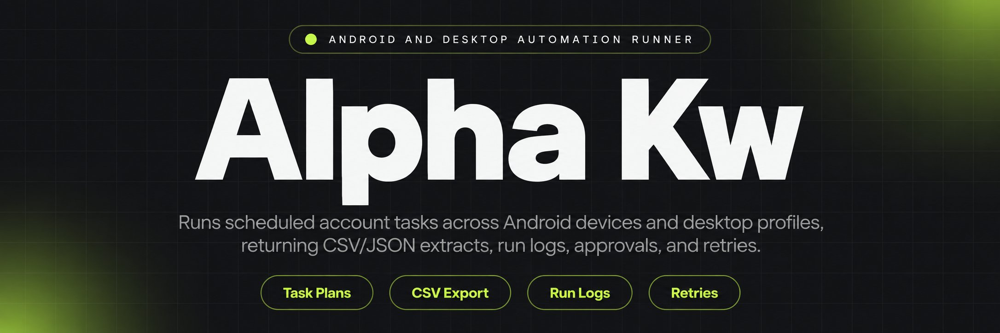
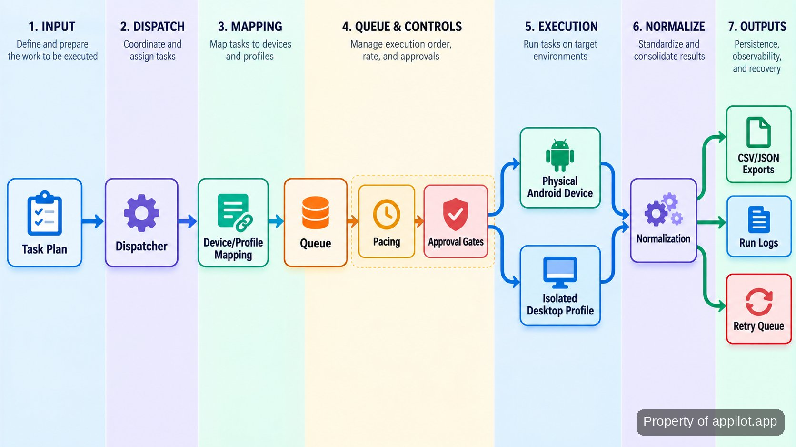

<p align="center">
  <a href="https://www.appilot.app" target="_blank" rel="nofollow">
    
  </a>
</p>

## alpha kw

`alpha kw` is the repository I use to run scheduled account work across <a href="https://developer.android.com/tools/adb" target="_blank" rel="nofollow">physical Android devices</a> and isolated desktop profiles. A run starts from a task plan, maps work to the right device or profile, applies pacing and approval rules, executes the allowed actions, and records what happened. For extraction jobs, the same run writes normalized CSV or JSON datasets rather than leaving app data buried in a device session.

The useful distinction is operational: this is not an emulator launcher or a collection of one-off scripts. The Android side talks to genuine hardware through Android Debug Bridge and <a href="https://appium.io/docs/en/latest/quickstart/uiauto2-driver/" target="_blank" rel="nofollow">Appium</a> sessions, while desktop work can route into fingerprint-isolated profiles. Operators get schedules, queues, retries, live run logs, and pause rules in one place. That makes it practical to leave routine work running overnight without giving high-risk actions an unchecked path to every account.

<a href="https://www.appilot.app" target="_blank" rel="nofollow">
  
</a>

<p align="center">
  <a href="https://t.me/Bitbash333" target="_blank" rel="nofollow">
    
  </a>&nbsp;
  <a href="https://wa.me/923249868488?text=Hi%2C%20I%27m%20interested." target="_blank" rel="nofollow">
    
  </a>&nbsp;
  <a href="mailto:hello@appilot.app" target="_blank" rel="nofollow">
    
  </a>&nbsp;
  <a href="https://www.appilot.app" target="_blank" rel="nofollow">
    
  </a>
</p>

## How a run moves from plan to output

Each run follows the same visible pipeline. A YAML task plan names the account group, action type, schedule window, pacing rule, and whether approval is required. The dispatcher, the component that assigns each task, resolves that plan against the device/profile map and places eligible work in a queue. Mobile tasks go to the paired Android device; desktop tasks go to the configured browser profile. The executor records success or failure per action instead of treating a whole batch as one opaque result.

On extraction jobs, captured fields pass through normalization, meaning they are mapped into consistent columns or keys before export. On engagement or warmup jobs, the output is the run record: what was attempted, what completed, what was skipped by a rule, and what is waiting for retry or approval. A failed session stays attached to its account and device/profile context, which matters when the next operator needs to see whether the problem came from the account, the profile, the device, or the action itself.



## Core Features

| Feature | Description |
| --- | --- |
| Physical device routing | Manual device picking becomes error-prone when many accounts are active. The dispatcher maps scheduled mobile work to provisioned Android hardware and keeps the device/account relationship visible in the run record. |
| Desktop profile routing | Repeatedly opening the right isolated browser profile wastes operator time and risks cross-account mistakes. Tasks can be routed to configured <a href="https://localapi-doc-en.adspower.com/docs/Rdw7Iu" target="_blank" rel="nofollow">AdsPower Local API</a> or <a href="https://multilogin.com/help/en_US/api" target="_blank" rel="nofollow">Multilogin automation API</a> profile groups before browser actions begin. |
| Warmup-aware pacing | Fast, uniform action bursts are a poor fit for accounts that are still being warmed up. Queue rules apply staged pacing and rate limits, and pause rules can stop further work when risk conditions are met. |
| Approval gates | Some account actions should not run unattended. High-risk steps can wait in an approval state while lower-risk scheduled work continues through the same queue. |
| Structured extraction | App data is difficult to reuse when it stays inside screen-level sessions. Extraction jobs map selected fields into normalized CSV or JSON output that can be handed to downstream analysis or warehouse loading. |
| Logs, retries, and recovery | A single device or session failure should not erase the rest of a batch. The run log records per-task status and retains failed work for controlled retry rather than silently repeating everything. |

## Inputs, pacing, and governance

The main input is a task plan plus the account-to-device or account-to-profile mapping it references. For scheduled outreach, engagement, posting, or warmup, the plan carries the action type, target account group, allowed run window, pacing settings, and approval requirement. A rate limit is simply the rule that caps how quickly actions may be attempted; a warmup rule changes that pace according to the account stage instead of treating every account the same.

Governance is deliberately visible. An approval gate can hold a high-risk action before execution, and pause-on-risk rules can remove an account from the active queue without deleting its history. Those controls do not make an account undetectable and they do not decide whether a platform flags or bans it. They give the operator a documented place to constrain automation, inspect failures, and stop the next action before a questionable sequence keeps running.

## Runtime stack and external control points

The runner is a <a href="https://docs.python.org/3/" target="_blank" rel="nofollow">Python</a> application with separate adapters for mobile devices, desktop profiles, scheduling, exports, and run-state logging. Physical Android control uses ADB plus the Appium UiAutomator2 driver. ADB provides the host-to-device command channel; its server listens locally on TCP port `5037`, a documented protocol detail rather than a repository-specific performance claim.

Desktop adapters call AdsPower or Multilogin to start and stop the correct profile, then hand browser control to <a href="https://playwright.dev/docs/intro" target="_blank" rel="nofollow">Playwright</a>. AdsPower documents a default local API port of `50325`; that endpoint stays in configuration rather than being scattered through task code. For broader mobile and social context, the <a href="https://www.gsma.com/about-us/regions/europe/gsma_resources/the-mobile-economy-2026/" target="_blank" rel="nofollow">GSMA Mobile Economy 2026</a> and <a href="https://datareportal.com/reports/digital-2026-global-overview-report" target="_blank" rel="nofollow">Digital 2026 Global Overview</a> are useful external reference points for the device and social environments this kind of operation sits inside.

<a href="https://tally.so/r/yP5oDx?platform=GitHub&amp;format=Product+repo&amp;brand=Appilot&amp;niche=appilot&amp;page=Alpha+Kw+on+Android+Hardware&amp;date=2026-09-24" target="_blank" rel="nofollow">
  
</a>

## Project directory

The repository keeps orchestration separate from platform adapters so a device failure does not leak platform-specific logic into scheduling or exports. Configuration lives outside the executors: account mappings, warmup plans, approval rules, and export schemas can be reviewed before a run. The command-line interface (CLI) is the operator entry point, while the `runs/` directory is generated output rather than source.

```text
project/
├── README.md
├── requirements.txt
├── configs/
│   ├── devices.yaml
│   ├── profiles.yaml
│   ├── warmup.yaml
│   ├── approvals.yaml
│   └── exports.yaml
├── src/
│   ├── cli.py
│   ├── scheduler.py
│   ├── dispatcher.py
│   ├── queue.py
│   ├── mobile/
│   │   ├── adb.py
│   │   └── appium_driver.py
│   ├── desktop/
│   │   ├── adspower.py
│   │   ├── multilogin.py
│   │   └── browser.py
│   ├── exports/
│   │   ├── normalize.py
│   │   ├── csv_writer.py
│   │   └── json_writer.py
│   └── logging/
│       ├── runlog.py
│       └── retry.py
└── runs/
    └── .gitkeep
```

```bash
python -m venv .venv
source .venv/bin/activate
pip install -r requirements.txt
python -m src.cli validate --config configs
python -m src.cli run --plan configs/warmup.yaml
```

The validation command catches missing device IDs, unknown profile groups, and malformed rule references before tasks enter the queue. The run command then uses the selected plan as the single source for scheduling and pacing; generated CSV, JSON, and run-log files appear under `runs/`.

## How to Run Account Work Using alpha kw

- **STEP 1 — Download & Set Up the Project** Download, set up, and install **alpha kw** from this repository, create the virtual environment, install the requirements, then validate the checked-in configuration files.
- **STEP 2 — Open the Runner** Start from the CLI and run the configuration validator so device IDs, profile groups, export rules, and approval references resolve before scheduling begins.
- **STEP 3 — Choose the Plan** Pass the task plan you intend to run, then review its account group, action type, run window, pacing rule, and approval requirement.
- **STEP 4 — Run and Inspect Output** Launch the run from the CLI. Review `runs/` for CSV or JSON extracts, task status, skipped actions, approvals, and retry records.

## Use Cases

- Run staged account warmup on paired Android devices, with account-specific pacing and pause rules instead of manually opening each phone and remembering where every account is in the sequence.
- Route repetitive desktop account work to the correct isolated profile group, keeping profile selection in configuration rather than relying on an operator to match accounts by hand.
- Collect structured fields from mobile app sessions and export normalized CSV or JSON files, so the result can be analyzed without copying values out of screens one record at a time.
- Queue scheduled outreach, engagement, or posting actions with approval gates for the steps that should remain human-controlled, while routine eligible tasks continue through the run.

## Outputs, logs, and failure recovery

A successful extraction run produces normalized CSV or JSON plus a run log. A successful action run may have no dataset at all; its useful output is the audit trail showing account, assigned device or profile, action, status, and any governing rule that changed execution. That distinction keeps operators from treating every workflow as if it should end in the same artifact.

Failures are recorded at task level. A disconnected phone, a profile that will not start, or an action that cannot complete is marked against its own context and can be placed into the retry path. Approval holds and pause-on-risk states are not failures, so they remain distinguishable in the log. That makes overnight runs easier to inspect in the morning: completed work stays completed, blocked work stays blocked, and retry candidates do not disappear into console output.

## Operating boundaries that matter

The repository automates execution and record-keeping; it does not control the rules or enforcement systems of the platforms being used. Pacing, warmup, device/profile pairing, and approval gates are operator controls, not a promise that an account will avoid flags or bans. The right use is to encode the limits you intend to follow, keep risky actions reviewable, and preserve enough run context to understand what happened.

The same boundary applies to data extraction. The runner can capture configured fields from app sessions and normalize them for export, but the repository does not turn that into permission to collect any data from any service. Access rights, platform terms, and applicable rules still sit outside the automation. Technically, the tool is most useful when the workflow is already understood and the problem is repeatable execution across many devices or profiles.

## FAQ

### Why does this run on physical Android devices instead of emulators?

The mobile path is designed around genuine Android hardware, so the scheduler assigns work to provisioned phones rather than starting emulator instances. That keeps device/account pairing, app sessions, and mobile extraction attached to the same physical-device context the operator is actually managing.

### Does the automation prevent accounts from being flagged or banned?

No. The repository provides pacing, warmup stages, rate limits, approval gates, and pause rules, but it cannot decide how an external platform evaluates an account. Those controls exist to make automated behavior constrained and reviewable, not to promise an outcome outside the tool's control.

### What happens when a device, profile, or task fails during a run?

The failure is recorded against the affected task with its account and device/profile context, while unrelated completed work remains completed. Retryable work is kept in the retry path, and approval or risk pauses stay separate from technical failures so an operator can decide what should run next.

<table>
  <tr>
    <td align="center" width="33%">
      
      <p>This scraper helped me gather thousands of posts effortlessly. The setup was fast, and exports are super clean and well-structured.</p>
      <p><b>Nathan Pennington</b><br>Marketer<br>★★★★★</p>
    </td>
    <td align="center" width="33%">
      
      <p>What impressed me most was how accurate the extracted data is. Likes, comments, timestamps — everything aligns perfectly.</p>
      <p><b>Greg Jeffries</b><br>SEO Affiliate Expert<br>★★★★★</p>
    </td>
    <td align="center" width="33%">
      
      <p>It's by far the best tool I've used. Ideal for trend tracking, competitor monitoring, and influencer insights.</p>
      <p><b>Karan</b><br>Digital Strategist<br>★★★★★</p>
    </td>
  </tr>
</table>