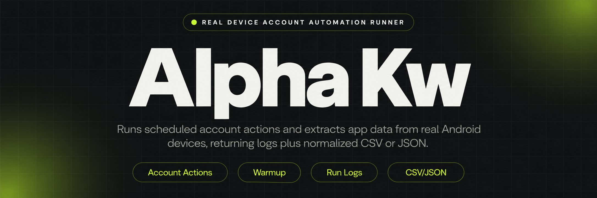
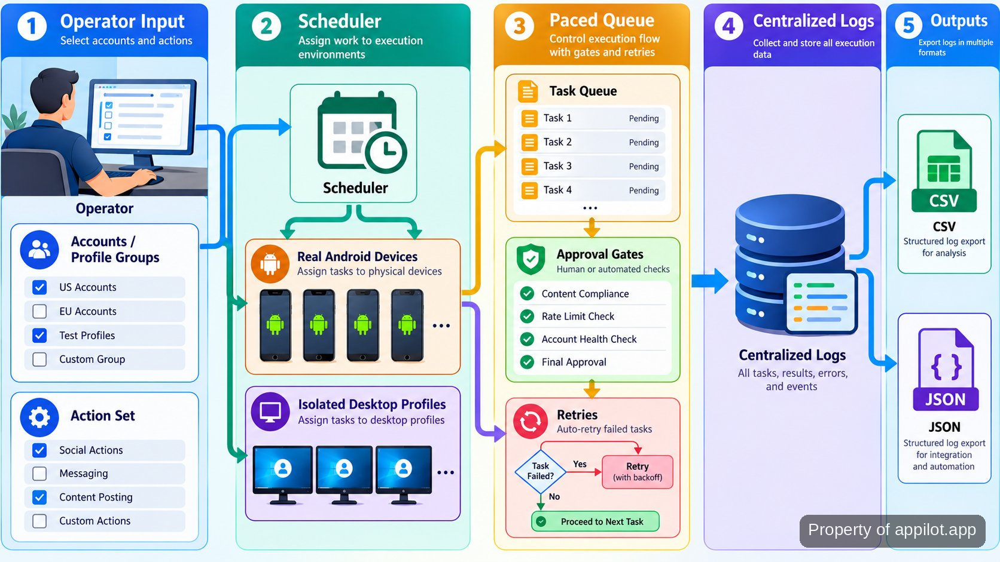

<p align="center">
  <a href="https://www.appilot.app" target="_blank" rel="nofollow">
    
  </a>
</p>

## alpha kw

`alpha kw` is the repository I use to run scheduled mobile and desktop account automation without putting the work on emulators. The mobile path uses genuine <a href="https://source.android.com/docs" target="_blank" rel="nofollow">Android</a> devices; the desktop path routes work through isolated browser profiles. In practice, that means the same project can schedule account actions, pace them per account, pause higher-risk actions for approval, retry failed work, and leave a log that an operator can inspect later. It also supports structured app-data extraction, so a run can end in CSV or JSON rather than a screen full of copied values.

The project is aimed at operators handling many accounts or profiles at once, where manual repetition becomes the bottleneck and getting flagged is the expensive failure mode. It does not promise undetectable behavior or a ban-proof setup. The useful controls are more concrete: staged warmup, rate limits, queues, device-to-profile pairing, health checks, pause-on-risk rules, centralized logs, and explicit approval gates before sensitive actions continue.

<a href="https://www.appilot.app" target="_blank" rel="nofollow">
  
</a>

<p align="center">
  <a href="https://t.me/Bitbash333" target="_blank" rel="nofollow">
    
  </a>&nbsp;
  <a href="https://wa.me/923249868488?text=Hi%2C%20I%27m%20interested." target="_blank" rel="nofollow">
    
  </a>&nbsp;
  <a href="mailto:hello@appilot.app" target="_blank" rel="nofollow">
    
  </a>&nbsp;
  <a href="https://www.appilot.app" target="_blank" rel="nofollow">
    
  </a>
</p>

## Core Features

The feature set is intentionally operational. Each row below corresponds to work that would otherwise be repeated by hand across devices, profiles, or app sessions. The system keeps those actions visible enough that an operator can stop, retry, or inspect them instead of treating automation as a black box.

| Feature | Description |
| --- | --- |
| Real Android device runs | Emulator-only flows can behave differently from the hardware an account normally uses. This path runs app sessions on physical Android phones and keeps device operations centrally scheduled. |
| Desktop profile routing | Opening isolated browser identities by hand does not scale. Tasks are routed through <a href="https://localapi-doc-en.adspower.com/docs/" target="_blank" rel="nofollow">AdsPower Local API</a> or <a href="https://multilogin.com/help/en_US/api" target="_blank" rel="nofollow">Multilogin API</a> profile groups, with timing and session-hygiene rules applied around each session. |
| Warmup playbooks | New or cold accounts should not jump straight into volume. Staged warmup sequences pace activity by account and keep device and profile pairings stable over time. |
| Rate limits and queues | Bursting the same action across many accounts creates avoidable risk. Per-account pacing and queued execution keep actions spread out instead of firing all at once. |
| Approval gates | Some account actions should not be automatic. High-risk steps can stop for operator approval before the run proceeds. |
| Structured extraction | Copying app data into spreadsheets is slow and error-prone. App sessions map requested fields into normalized CSV or JSON exports that are ready for downstream loading. |
| Retries and failure alerts | A dropped session should not silently remove work from the queue. Failed steps are logged, retried, and surfaced for operator review. |

## Run Pipeline

A normal run has four visible stages. First, the operator selects the account or profile group and the action set: warmup, outreach, engagement, posting, or extraction. Second, the scheduler assigns work to the matching device or desktop profile while applying the account’s pacing rules. Third, the session executes one queued action at a time, recording status and stopping where an approval gate or risk rule requires a human decision. Fourth, the run writes its evidence: logs for every action and, for extraction jobs, structured dataset files.

That order matters. Device assignment happens before action execution, so account-to-device pairing is not an afterthought. Pacing is applied before the action fires, not checked afterward. Recovery also sits in the run itself: a failed action becomes a logged retry candidate instead of disappearing. For extraction work, field mapping happens before export, which is what keeps the final CSV and JSON consistent enough to hand to another process.



## Controls for Accounts and Profiles

The controls are designed around the things that usually break first when account volume rises. A rate limit is simply a cap on how quickly actions may be attempted for one account. Warmup is a staged schedule that increases activity gradually instead of starting at the final operating level. A profile is the isolated desktop identity used for a session, while device pairing ties a mobile account to a consistent physical phone.

Those controls are useful because the platform, not this repository, decides whether an account is trusted, challenged, or banned. The project therefore manages the behavior it can actually control: timing, queue order, session hygiene, pairing, health scoring, automated pause rules, and human approval. A flagged account can be stopped rather than pushed through the remaining queue. A higher-risk action can wait for approval. A failed session can be retried with its prior status preserved in the log.

For background on automation risk rather than guarantees, I keep the <a href="https://owasp.org/www-project-automated-threats-to-web-applications/" target="_blank" rel="nofollow">OWASP automated-threat taxonomy</a> and <a href="https://source.android.com/docs/security" target="_blank" rel="nofollow">Android security guidance</a> beside the runbook. They are reference points for reviewing behavior and device handling, not evidence that any social platform approves a particular automation pattern.

<a href="https://tally.so/r/yP5oDx?platform=GitHub&amp;format=Product+repo&amp;brand=Appilot&amp;niche=appilot&amp;page=alpha+kw+on+Android+Devices&amp;date=2026-09-24" target="_blank" rel="nofollow">
  
</a>

## Tech Stack and External Interfaces

The repository is organized as a <a href="https://docs.python.org/3/" target="_blank" rel="nofollow">Python</a> runner with separate adapters for mobile devices, desktop profiles, scheduling, exports, and operator-visible logging. Android sessions use the standard device-control path documented in <a href="https://developer.android.com/tools/adb" target="_blank" rel="nofollow">Android Debug Bridge</a>, while the higher-level mobile automation layer follows <a href="https://appium.io/" target="_blank" rel="nofollow">Appium</a> session semantics. Desktop jobs keep provider-specific calls behind adapter modules so profile selection is separate from the action logic.

Data leaving the system is deliberately boring. CSV is the tabular handoff format, aligned with <a href="https://www.rfc-editor.org/rfc/rfc4180" target="_blank" rel="nofollow">RFC 4180</a>, and JSON is the structured interchange format described by <a href="https://www.rfc-editor.org/rfc/rfc8259" target="_blank" rel="nofollow">RFC 8259</a>. Keeping exports simple matters more than adding another storage dependency: a CSV can be opened directly, while JSON can feed a warehouse loader or another script without scraping the operator dashboard.

The important boundary is that device control, profile control, action logic, and export logic are separate modules. A change to field mapping should not alter pacing, and a profile-provider change should not rewrite mobile session code.

## Project Directory and Commands

The file layout mirrors the run pipeline so failures are easy to place. Configuration lives apart from execution code; device and profile adapters are separated; action definitions do not own export formatting; logs and datasets have their own output directories. That separation is more useful in day-to-day operation than a large single runner because an operator can tell whether a problem came from assignment, session execution, field mapping, or output writing.

```text
alpha-kw/
├── config/
│   ├── accounts.yaml
│   ├── devices.yaml
│   ├── profiles.yaml
│   └── policies.yaml
├── src/
│   ├── runner.py
│   ├── scheduler.py
│   ├── devices/
│   │   ├── android.py
│   │   └── sessions.py
│   ├── profiles/
│   │   ├── adspower.py
│   │   └── multilogin.py
│   ├── actions/
│   │   ├── warmup.py
│   │   ├── engagement.py
│   │   ├── outreach.py
│   │   ├── posting.py
│   │   └── extract.py
│   ├── exports/
│   │   ├── csv_writer.py
│   │   └── json_writer.py
│   └── monitoring/
│       ├── logs.py
│       ├── retries.py
│       └── alerts.py
├── runs/
│   └── .gitkeep
├── requirements.txt
└── README.md
```

The two commands I use most are dependency installation and a live run. The first installs the repository requirements; the second starts the queued action set and writes run artifacts under `runs/latest/`.

```bash
python -m pip install -r requirements.txt
python -m src.runner run --config config --output runs/latest
```

## How to Run alpha kw

Setup is short once Python, the device bridge, and the required profile-provider access are in place. The important part is not installation; it is loading the right account, device, profile, pacing, and approval rules before the first live queue starts.

- **STEP 1 - Download & Set Up the Project** Download, set up, and install **alpha kw** from this repository, then install its Python dependencies and copy the example configuration into `config/`.
- **STEP 2 - Open the Operator View** Start the runner, confirm connected Android devices and available desktop profiles, then inspect the pending queue before any account action begins.
- **STEP 3 - Configure the Run** Select accounts or profile groups, choose warmup, outreach, engagement, posting, or extraction, then set pacing, approval, and pause-on-risk rules.
- **STEP 4 - Run and Read the Output** Start the queued run, watch live logs and retries, then read the run record plus CSV or JSON output when extraction is enabled.

## Outputs, Performance Checks, and Use Cases

Every run should leave enough evidence to answer three questions: what was scheduled, what actually happened, and what needs attention next. The primary operational output is the centralized run log with per-action status, retries, and failures. Extraction jobs add two structured output formats, CSV and JSON. That split keeps monitoring separate from data delivery: the log explains the run; the dataset carries the collected fields.

I do not publish a made-up throughput figure for accounts per hour. The useful performance checks are queue age, retry count, failed-session count, approval waits, and whether assigned devices or profiles are available when their work reaches the front. For a four-stage run, those checkpoints also make it easier to locate delay: assignment, pacing, execution, or output writing. The benchmark is operational consistency, not a headline number the repository cannot support.

- Run staged warmup across many accounts while keeping device or profile pairing stable and pausing accounts that cross a risk rule.
- Schedule outreach, engagement, or posting actions with per-account pacing instead of repeating the same manual sequence across profiles.
- Extract app data from real Android sessions, normalize the requested fields, and hand the result to a spreadsheet or warehouse loader as CSV or JSON.
- Route desktop work across AdsPower or Multilogin profile groups while keeping session timing, logs, and retry handling in one operator workflow.

## FAQ

### Does the tool run on emulators?

No. The mobile path is built around genuine Android hardware, with centralized scheduling and remote device operations. Desktop work uses isolated browser profiles instead of trying to imitate mobile sessions inside an emulator.

### What happens when an account is flagged or a run fails?

The system can pause on risk, hold higher-risk actions for operator approval, log failures, and retry failed work. Those controls reduce blind automation, but they do not guarantee that an account will avoid review, restriction, or a ban.

### What data can the tool export?

Extraction runs can produce structured CSV and JSON datasets with custom field mapping and normalization. Those files are suitable for direct inspection or for loading into another data workflow without copying values from the app by hand.

<table>
  <tr>
    <td align="center" width="33%">
      
      <p>This scraper helped me gather thousands of posts effortlessly. The setup was fast, and exports are super clean and well-structured.</p>
      <p><b>Nathan Pennington</b><br>Marketer<br>★★★★★</p>
    </td>
    <td align="center" width="33%">
      
      <p>What impressed me most was how accurate the extracted data is. Likes, comments, timestamps — everything aligns perfectly.</p>
      <p><b>Greg Jeffries</b><br>SEO Affiliate Expert<br>★★★★★</p>
    </td>
    <td align="center" width="33%">
      
      <p>It's by far the best tool I've used. Ideal for trend tracking, competitor monitoring, and influencer insights.</p>
      <p><b>Karan</b><br>Digital Strategist<br>★★★★★</p>
    </td>
  </tr>
</table>