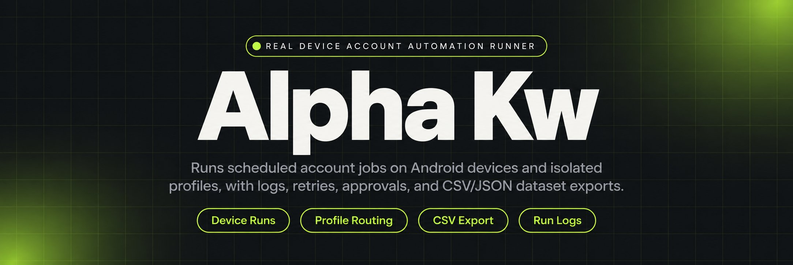
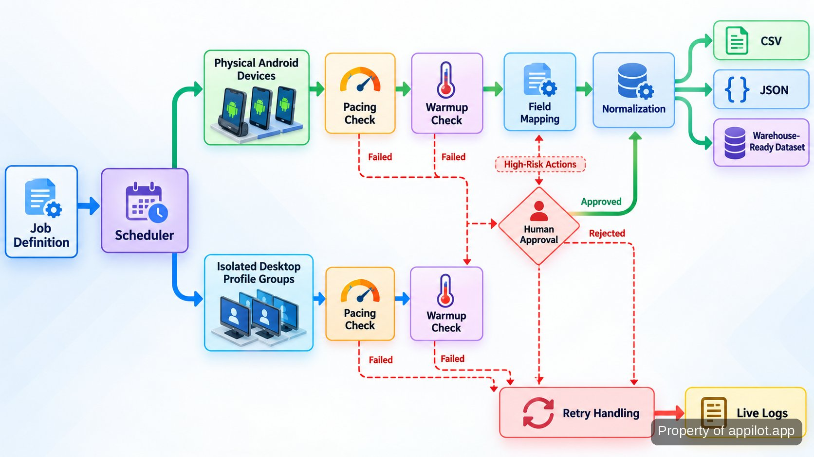

<p align="center">
  <a href="https://www.appilot.app" target="_blank" rel="nofollow">
    
  </a>
</p>

## Alpha Kw

Alpha Kw is the automation runner I use for account work that has to happen across physical Android devices and isolated desktop profiles instead of being repeated by hand. It schedules outreach, engagement, warmup and app-data extraction, then keeps the run visible through logs, retries and operator controls. Use it when many accounts or devices need the same governed routine, when manual handling no longer scales, and when pacing and approval gates matter. The repository is aimed at operators who need repeatable runs, visible exceptions and structured outputs rather than another per-account checklist.

The system is not presented as undetectable or ban-proof. Platform outcomes remain outside the tool’s control. What it does provide is the operating layer around account actions: staged warmup, rate limits, queues, human approval for higher-risk actions, device/profile pairing, extraction, export and failure recovery. That makes the repository useful as an operations project, not a promise that a platform will accept every automated action.

<a href="https://www.appilot.app" target="_blank" rel="nofollow">
  
</a>

<p align="center">
  <a href="https://t.me/Bitbash333" target="_blank" rel="nofollow">
    
  </a>&nbsp;
  <a href="https://wa.me/923249868488?text=Hi%2C%20I%27m%20interested." target="_blank" rel="nofollow">
    
  </a>&nbsp;
  <a href="mailto:hello@appilot.app" target="_blank" rel="nofollow">
    
  </a>&nbsp;
  <a href="https://www.appilot.app" target="_blank" rel="nofollow">
    
  </a>
</p>

## What the run controls

A run starts from a job definition. The job names the target device pool or desktop profile group, the action queue, the warmup state, the approval rule and the export format. Mobile actions are dispatched to genuine Android hardware; desktop tasks are routed through isolated profiles. A desktop profile here means a browser identity with its own fingerprint and session state, kept separate from other accounts.

Scheduling and pacing sit between the job and the account action. The queue can hold outreach, engagement, posting or warmup work, while rate limits and session-hygiene rules keep actions from firing as a burst. Higher-risk actions can stop at an approval gate. During mobile extraction, app-session instrumentation collects the fields, applies the mapping and normalization, and sends the dataset to CSV, JSON or a warehouse-ready export.

That order removes the failure mode where account state, pacing and output handling live in separate spreadsheets or operator memory. The run shows what was scheduled, what reached a device or profile, what was retried, what was paused and what was exported.

## Core Features

| Feature | Description |
| --- | --- |
| Physical Android execution | Emulator-only flows can behave differently from the production environment. Mobile jobs run on genuine Android hardware with centralized scheduling and remote device operations. |
| Desktop profile routing | Account sessions become hard to separate when operators reuse browser state. Tasks route through fingerprint-isolated profiles managed through AdsPower or Multilogin integrations. |
| Warmup-aware pacing | New or sensitive accounts should not receive the same action volume as established ones. Staged warmup, queues and rate limits control when account actions become eligible to run. |
| Approval gates | Automation should not make every consequential decision unattended. Higher-risk account actions can wait for human approval before execution. |
| Structured extraction | Raw app sessions are awkward to reuse downstream. Field mapping and normalization turn extracted app data into CSV, JSON or warehouse-ready datasets. |
| Retries and alerts | A dropped device or failed profile task should not disappear silently. Run logs, retry handling and real-time failure alerts expose the failure and keep recovery operational. |
| Campaign reporting | Operators need to know what happened across many accounts. Central reporting records queued and executed campaign activity without requiring per-account manual checks. |

## Workflow from job to output

The pipeline is visible from the operator’s side. A job enters the scheduler with its device or profile target, action queue, pacing state and any approval requirement. The scheduler routes mobile work to physical Android devices and desktop work to the configured profile manager. Before an action executes, pacing and warmup rules decide whether it can run now; higher-risk actions can pause for approval. Failures move into retry handling and stay visible in logs rather than vanishing into a dead session.

Extraction follows the same operational path. The app session is instrumented on the device, requested fields are collected, mappings are applied, and the normalized result is exported. CSV follows the tabular conventions described by <a href="https://www.rfc-editor.org/rfc/rfc4180" target="_blank" rel="nofollow">RFC 4180</a>; JSON output follows <a href="https://www.rfc-editor.org/rfc/rfc8259" target="_blank" rel="nofollow">RFC 8259</a>. Those formats keep the output portable without requiring the next system to understand the app session that produced it. The export is therefore the end of a traceable run, not a detached file with no history.



## Tech stack and operating surface

The mobile side uses physical Android devices and <a href="https://developer.android.com/tools/adb" target="_blank" rel="nofollow">Android Debug Bridge</a>, commonly shortened to ADB, to inspect and control attached hardware. The repository’s `.py` modules use <a href="https://docs.python.org/3/" target="_blank" rel="nofollow">Python 3</a> for scheduling, routing, extraction and operator services, keeping the control path readable when a run needs diagnosis.

Desktop automation uses API-native profile-manager integration rather than manual profile selection. The repository keeps adapters for <a href="https://localapi-doc-en.adspower.com/" target="_blank" rel="nofollow">AdsPower Local API</a> and <a href="https://multilogin.com/help/en_US/api/" target="_blank" rel="nofollow">Multilogin API</a> behind the same routing layer, so profile-group jobs can use the manager assigned to that account set. Session hygiene and humanized timing are run controls, not guarantees about detection or account status.

Logging records dispatch, approval, execution, retry and export states so a failed run can be reconstructed. <a href="https://csrc.nist.gov/pubs/sp/800/92/final" target="_blank" rel="nofollow">NIST SP 800-92</a> is a useful logging-management reference, while the <a href="https://mas.owasp.org/MASVS/" target="_blank" rel="nofollow">OWASP Mobile Application Security Verification Standard</a> provides a baseline for mobile app security concerns around instrumentation and data handling.

<a href="https://tally.so/r/yP5oDx?platform=GitHub&amp;format=Product+repo&amp;brand=Appilot&amp;niche=appilot&amp;page=Alpha+Kw+on+Android+Hardware&amp;date=2026-09-24" target="_blank" rel="nofollow">
  
</a>

### Project directory

The repository separates scheduling, device control, desktop profiles, pacing, approvals, extraction and exporting so changes do not land in one oversized runner. Configuration sits beside runbooks, making account-group rules inspectable before a run. Logs and generated data stay outside control modules, and tests mirror recovery boundaries: routing, pacing and export formatting.

```text
automation-runner/
├── config/
│   ├── devices.yaml
│   ├── profiles.yaml
│   └── jobs/
│       └── nightly.yaml
├── src/
│   ├── scheduler.py
│   ├── device_runner.py
│   ├── desktop_profiles.py
│   ├── pacing.py
│   ├── approvals.py
│   ├── extractors.py
│   ├── exporters.py
│   ├── runlog.py
│   ├── app.py
│   └── dashboard.py
├── data/
│   └── exports/
├── logs/
├── runbooks/
│   ├── device-recovery.md
│   └── profile-failure.md
├── tests/
│   ├── test_routing.py
│   ├── test_pacing.py
│   └── test_exports.py
├── requirements.txt
└── README.md
```

## How to Run Account Automation Using Alpha Kw

- **STEP 1 - Download & Set Up the Project.** Download, set up, and install **Alpha Kw** to get the project running. Obtain the build by cloning this repository and loading its configuration.
- **STEP 2 - Open the dashboard.** Start the service, open the operator dashboard, and select the scheduled job so its device pool, profile group and current run state are visible.
- **STEP 3 - Configure the run.** Set the action queue, target devices or profiles, warmup stage, pacing rules, approval gate and required CSV, JSON or warehouse-ready export.
- **STEP 4 - Run and inspect.** Use **Run Job**, then watch dispatch, retry, approval and export events in the live log until the requested actions and dataset output complete.

```bash
python -m pip install -r requirements.txt
python -m src.app validate config/jobs/nightly.yaml
python -m src.app run config/jobs/nightly.yaml
python -m src.app status
```

Validation is the checkpoint before execution: it resolves the selected job against known devices, profile groups and run rules. After the run starts, the dashboard becomes the operator view for dispatch, retry, approval and export states.

## Use Cases

- Run scheduled outreach and engagement across many accounts without turning each account into a separate manual checklist. Queues, pacing and operator logs keep the work inspectable.
- Warm up account groups before higher-volume campaigns. Staged playbooks, device/profile pairing and pause-on-risk rules keep the transition governed rather than abrupt.
- Extract structured data from a mobile app on genuine Android hardware, normalize the requested fields and export a dataset that can move into CSV, JSON or a warehouse pipeline.
- Route desktop tasks across isolated profile groups in AdsPower or Multilogin while keeping the account-to-profile assignment visible and the failure path centralized.

These cases share the same operating model: define the account or device group once, let the scheduler apply the stored pacing and approval rules, then inspect one run log instead of reconstructing activity from individual sessions. The system is most useful where repeatability and recovery matter alongside the action itself.

## Performance and failure handling

Performance is judged from visible run state: queued work reaches a device or profile, pacing holds actions until eligible, approval-required work waits visibly, failures enter retry handling, and exports close with a usable dataset. I do not treat a generic accounts-per-minute figure as meaningful because workload changes with action type, device state, warmup stage and approval requirements.

The useful operational check is whether failure is recoverable without guessing. A device problem should identify the affected job and return it to the retry path; a profile error should stay attached to its task; an extraction problem should fail before a partial dataset is mistaken for a complete one. Alerts bring the exception to the operator, while runbooks record recurring recovery paths.

Rate limits and humanized timing reduce bursty behavior, but they do not decide whether a platform flags or bans an account. Health scoring and pause-on-risk rules can stop the automation from pressing ahead when an account looks unhealthy; the final outcome still belongs to the platform and the operator’s decisions.

## Operator guardrails

Warmup stage, pacing, profile pairing and approval state are first-class run inputs. A risky change can be reviewed before execution, and an operator has a clear place to pause work when an account is flagged. Keeping those rules with the job also prevents handling from drifting between shifts.

For extracted app data, mapping and normalization happen before export. For account actions, the log separates what was queued from what actually executed. That distinction matters after a device disconnect or profile failure because the report should describe the run that happened, not only the scheduler’s intention.

The boundary is clear: the tool controls scheduling, pacing, approvals, retries, extraction and reporting. It does not control the external platform’s decision about an account, so guardrails are operating controls rather than a promise about bans or flags. The log and approval state make that boundary visible during review.

## FAQ

### Does the tool use emulators?

No. Mobile automation runs on genuine Android hardware rather than emulators. Device scheduling, remote operations and app-session instrumentation are built around physical phones, while desktop account work uses isolated browser profiles.

### How are risky account actions controlled?

Higher-risk actions can stop at a human approval gate before execution. Warmup-aware pacing, queues, rate limits, health scoring and pause-on-risk rules add operational controls, but none of them guarantees that a platform will not flag or ban an account.

### What happens when a device or profile task fails?

The failure stays visible in centralized logs and enters retry handling instead of disappearing silently. Real-time alerts surface the exception, and the repository includes runbooks for recurring device and profile recovery paths.

<table>
  <tr>
    <td align="center" width="33%">
      
      <p>This scraper helped me gather thousands of posts effortlessly. The setup was fast, and exports are super clean and well-structured.</p>
      <p><b>Nathan Pennington</b><br>Marketer<br>★★★★★</p>
    </td>
    <td align="center" width="33%">
      
      <p>What impressed me most was how accurate the extracted data is. Likes, comments, timestamps — everything aligns perfectly.</p>
      <p><b>Greg Jeffries</b><br>SEO Affiliate Expert<br>★★★★★</p>
    </td>
    <td align="center" width="33%">
      
      <p>It's by far the best tool I've used. Ideal for trend tracking, competitor monitoring, and influencer insights.</p>
      <p><b>Karan</b><br>Digital Strategist<br>★★★★★</p>
    </td>
  </tr>
</table>