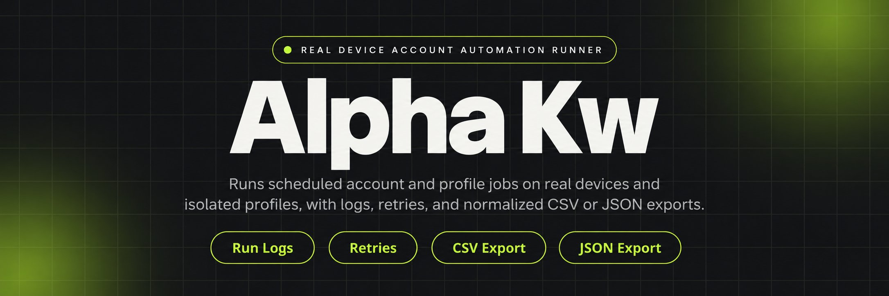
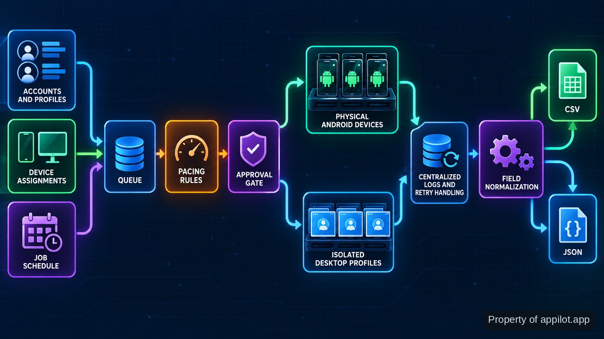

<p align="center">
  <a href="https://www.appilot.app" target="_blank" rel="nofollow">
    
  </a>
</p>

## alpha kw

alpha kw is the repository I use to run scheduled account work across physical Android devices and isolated desktop profiles without turning every action into a manual session. It covers the parts that matter once account count grows: pairing work to devices or profiles, pacing actions, holding higher-risk actions for approval, retrying failed jobs, and keeping run logs in one place. Mobile work stays on <a href="https://developer.android.com/studio/run/device" target="_blank" rel="nofollow">real Android hardware</a>, not emulators.

The same runner also handles structured mobile-app extraction and desktop profile tasks. Profile adapters can connect to <a href="https://help.adspower.com/docs/api" target="_blank" rel="nofollow">AdsPower Local API</a> or <a href="https://multilogin.com/help/en_US/api" target="_blank" rel="nofollow">Multilogin automation</a>, while extraction jobs write CSV or JSON. Those are two distinct output formats rather than screenshots or loose text dumps. The design is deliberately operator-facing: schedules, queues, warmup-aware pacing, approval gates, logs, retries, and exports are visible parts of a run.

<a href="https://www.appilot.app" target="_blank" rel="nofollow">
  
</a>

<p align="center">
  <a href="https://t.me/Bitbash333" target="_blank" rel="nofollow">
    
  </a>&nbsp;
  <a href="https://wa.me/923249868488?text=Hi%2C%20I%27m%20interested." target="_blank" rel="nofollow">
    
  </a>&nbsp;
  <a href="mailto:hello@appilot.app" target="_blank" rel="nofollow">
    
  </a>&nbsp;
  <a href="https://www.appilot.app" target="_blank" rel="nofollow">
    
  </a>
</p>

## How a run moves from input to output

A run starts with the accounts or profiles to work on, the devices or desktop profiles that can receive work, and a job definition describing the action and schedule. The scheduler places jobs into a queue instead of firing everything at once. Pacing rules then control when work may continue, and an approval gate can stop a sensitive action until an operator releases it.

Execution goes to the selected Android device or desktop profile adapter. Each result returns to the central log with a status that can be inspected before the next action. A recoverable failure enters the retry path; a risk condition can pause the affected job rather than letting the queue continue blindly. Extraction jobs add a normalization step so mapped fields land in a structured dataset. The export stage writes <a href="https://www.rfc-editor.org/info/rfc4180/" target="_blank" rel="nofollow">CSV</a> or <a href="https://www.rfc-editor.org/info/rfc8259/" target="_blank" rel="nofollow">JSON</a>, which makes the output usable outside the dashboard without another cleanup pass.



## Core Features

| Feature | Description |
| --- | --- |
| Physical Android execution | Manual phone handling breaks down as device count rises. Jobs are routed to genuine Android hardware so mobile app sessions run on physical devices rather than emulators. |
| Scheduled account actions | Repeated outreach, engagement, posting, or warmup work is hard to coordinate by hand. Queues and schedules place those actions into controlled runs. |
| Warmup-aware pacing | Fast, uniform activity can create unnecessary account risk. Rate limits, queues, and warmup-aware pacing govern when an account is allowed to take its next action. |
| Approval gates | Some account actions should not proceed unattended. Higher-risk actions can pause for human approval before execution continues. |
| Central logs and retries | A failed job is easy to miss across many devices. Run logs collect status centrally, while retry handling gives recoverable failures another controlled attempt. |
| Structured extraction | App data copied manually becomes inconsistent. Field mapping and normalization turn extracted records into CSV or JSON datasets. |

The desktop side keeps profile work isolated and routeable by profile group. The useful distinction is not “automation versus manual” but whether an operator can see what is scheduled, what is waiting, what failed, and what needs approval before another account action is attempted.

## Inputs, outputs, and operator controls

The input set is intentionally concrete. Account and profile lists identify the targets; device assignments state where mobile work should run; task settings choose the action; schedules define when jobs become eligible; rate limits and warmup state constrain pacing. For extraction, field mapping defines which values are collected and how they are normalized. No input is treated as permission to ignore platform-level restrictions or account health signals.

Outputs split into operational records and datasets. Operational records include run state, per-task logs, retry outcomes, and pauses that need attention. Extraction output is structured as CSV or JSON. That separation matters in practice: a dataset can move into later analysis, while the run log remains the audit trail for why a job completed, retried, paused, or stopped. I check both after overnight runs because a clean export does not by itself prove every queued action behaved as intended.

## Use Cases

- Run staged account warmup across assigned physical phones while keeping pacing and pause-on-risk rules in the same operator view.
- Schedule outreach, engagement, or posting jobs for many accounts without opening each profile manually; use queues and approval gates where an action needs human review.
- Extract structured records from a mobile app, normalize the requested fields, and write the result as CSV or JSON for later analysis or warehouse loading.
- Route repeatable desktop work to isolated AdsPower or Multilogin profiles while keeping task status and failures visible in centralized logs.

These cases share one operating model: define the account set, assign execution capacity, constrain the action, then inspect the run rather than assuming it succeeded. That makes the tool useful when the real problem is coordination across many accounts or devices, not when someone simply needs a one-off macro. It also keeps human control in the path. Approval gates are there for decisions that should not be delegated, and pacing is a control rather than a promise that a platform will accept the activity.

<a href="https://tally.so/r/yP5oDx?platform=GitHub&amp;format=Product+repo&amp;brand=Appilot&amp;niche=appilot&amp;page=Alpha+Kw+on+Android+Hardware&amp;date=2026-09-26" target="_blank" rel="nofollow">
  
</a>

## Tech Stack

| Layer | What it does here |
| --- | --- |
| Physical Android devices | Run mobile app sessions on genuine hardware and provide the device-side execution target. |
| Central scheduler | Turns job definitions into queued work and applies timing, pacing, and retry rules before execution. |
| Operator dashboard | Shows scheduled work, live logs, failures, retries, approvals, and paused jobs in one operating surface. |
| AdsPower / Multilogin adapters | Connect desktop profile groups to their documented automation interfaces without mixing profile state. |
| Normalization and export | Maps extracted fields into consistent records and writes CSV or JSON datasets. |

The important stack choice is the boundary between orchestration and execution. Scheduling, approvals, logging, and retry policy stay centralized, while the actual session runs on the assigned hardware or desktop profile. For desktop automation, the repository relies on the providers’ documented interfaces rather than treating the browser profile as an opaque click target. For operations, I use <a href="https://sre.google/sre-book/monitoring-distributed-systems/" target="_blank" rel="nofollow">Google SRE monitoring guidance</a> as a reference when deciding which states need to be visible for progress checks and failure diagnosis.

## Project Directory

The repository layout separates operator configuration from adapters and job logic. That keeps a device assignment change from looking like a code change and makes it clear where to inspect a failed route. Jobs are grouped by the action they perform; adapters contain the boundaries to Android hardware and supported desktop profile managers; scheduler, approvals, and logging hold the shared run controls. Input and output data live away from implementation files so exports can be collected without digging through logs.

```text
alpha-runner/
├── config/
│   ├── devices.yaml
│   ├── profiles.yaml
│   └── policies.yaml
├── jobs/
│   ├── warmup/
│   ├── engagement/
│   └── extraction/
├── adapters/
│   ├── android/
│   ├── adspower/
│   └── multilogin/
├── scheduler/
├── approvals/
├── logging/
├── exports/
├── data/
│   ├── inputs/
│   └── outputs/
└── scripts/
    ├── setup.sh
    ├── run.sh
    └── healthcheck.sh
```

The configuration files are the first place to look before a run: devices and profiles establish routing, while policies hold pacing and approval behavior. The `data/outputs` directory is for generated datasets; operational status belongs in the logging path instead of being mixed into exported records.

## Run checks and performance boundaries

There is no useful universal “accounts per hour” number for this repository. A warmup job, a mobile extraction session, and a desktop profile task have different work shapes, and device or account state can change what is safe to execute. I treat performance as observable progress: jobs leave the queue, device assignments remain valid, retries are bounded by policy, approvals stop where expected, and exports contain the mapped fields requested by the job.

Two checks are especially concrete. Extraction must produce one of the two supported structured outputs, CSV or JSON, and account actions pass through three pacing controls named in the operating model: rate limits, queues, and warmup-aware pacing. Logs should make failure states visible without exposing secrets; <a href="https://cheatsheetseries.owasp.org/cheatsheets/Logging_Cheat_Sheet.html" target="_blank" rel="nofollow">OWASP logging guidance</a> is the baseline I use when reviewing log contents. For alerts, <a href="https://sre.google/workbook/alerting-on-slos/" target="_blank" rel="nofollow">Google SRE alerting guidance</a> is a useful operational reference when deciding which conditions deserve attention. None of these controls guarantees that an external platform will accept an action.

## How to Run alpha kw

- **STEP 1 — Download & Set Up the Project** — Download, set up, and install **alpha kw** from this repository, then load the supplied configuration files for devices, profiles, policies, and job definitions.
- **STEP 2 — Open the Operator Dashboard** — Start the runner and open the dashboard to confirm assigned devices or desktop profiles are available and previous failures are not blocking the queue.
- **STEP 3 — Configure the Run** — Choose the job, account or profile group, schedule, rate limit, warmup state, and any approval requirement; extraction jobs also need the requested field mapping.
- **STEP 4 — Run and Inspect Output** — Press `Run`, watch live status and retries, then inspect the operational log; extraction jobs also write the normalized CSV or JSON dataset to outputs.

```bash
./scripts/setup.sh
./scripts/healthcheck.sh
./scripts/run.sh
```

For desktop profile work, confirm the relevant provider interface is available before starting the queue; the provider documentation should be checked before changing connection or profile-control settings. For mobile work, the target remains physical Android hardware. A successful start means the assigned execution target is reachable and the job enters the controlled queue, not that every downstream action is guaranteed to complete.

## FAQ

### Does it run on emulators?

No. Mobile automation in this repository is intended for genuine Android hardware. The point is to route scheduled work to physical devices while keeping scheduling, monitoring, retries, and operator controls centralized.

### Can it prevent accounts from being flagged or banned?

No. The tool can apply rate limits, queues, warmup-aware pacing, approval gates, health-based pauses, and session hygiene, but the platform ultimately decides how activity is treated. Those controls reduce uncontrolled behavior; they are not a guarantee against flags or bans.

### What does a data extraction run produce?

A completed extraction run produces normalized structured records in CSV or JSON. Field mapping decides which values are captured and how they are named, while the operational log separately records run status, failures, and retries.

<table>
  <tr>
    <td align="center" width="33%">
      
      <p>This scraper helped me gather thousands of posts effortlessly. The setup was fast, and exports are super clean and well-structured.</p>
      <p><b>Nathan Pennington</b><br>Marketer<br>★★★★★</p>
    </td>
    <td align="center" width="33%">
      
      <p>What impressed me most was how accurate the extracted data is. Likes, comments, timestamps — everything aligns perfectly.</p>
      <p><b>Greg Jeffries</b><br>SEO Affiliate Expert<br>★★★★★</p>
    </td>
    <td align="center" width="33%">
      
      <p>It's by far the best tool I've used. Ideal for trend tracking, competitor monitoring, and influencer insights.</p>
      <p><b>Karan</b><br>Digital Strategist<br>★★★★★</p>
    </td>
  </tr>
</table>