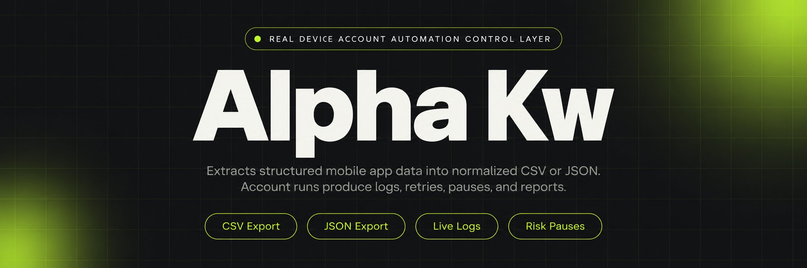
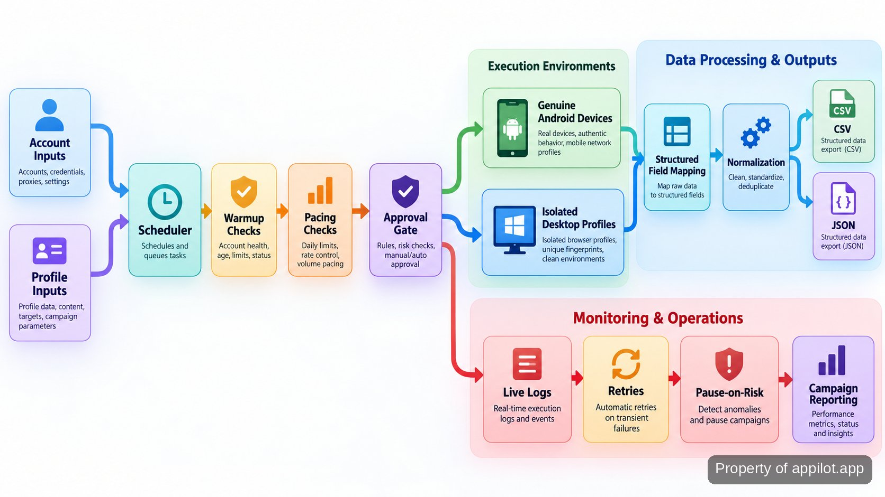

<p align="center">
  <a href="https://www.appilot.app" target="_blank" rel="nofollow">
    
  </a>
</p>

## alpha kw

I run **alpha kw** as the control layer for account work that would otherwise be split across phones, desktop profiles, spreadsheets, and manual checks. The repository drives genuine Android hardware, routes desktop tasks through fingerprint-isolated profiles, schedules account actions, and writes structured extraction results. It is meant for operators managing many accounts or devices at once, where a missed retry, an over-aggressive queue, or a hidden failure can turn into a flagged account before anyone notices.

The important boundary is simple: the tool controls pacing, approvals, warmup stages, retries, and operator visibility, but it does not decide whether a platform will accept an action. There is no ban-proof mode and no claim that automation is undetectable. The operating model is to make risky work slower, visible, and interruptible rather than pretending platform decisions can be engineered away.

<a href="https://www.appilot.app" target="_blank" rel="nofollow">
  
</a>

<p align="center">
  <a href="https://t.me/Bitbash333" target="_blank" rel="nofollow">
    
  </a>&nbsp;
  <a href="https://wa.me/923249868488?text=Hi%2C%20I%27m%20interested." target="_blank" rel="nofollow">
    
  </a>&nbsp;
  <a href="mailto:hello@appilot.app" target="_blank" rel="nofollow">
    
  </a>&nbsp;
  <a href="https://www.appilot.app" target="_blank" rel="nofollow">
    
  </a>
</p>

## Core Features

| Feature | Description |
| --- | --- |
| Real Android device fleet | Emulator drift is removed by running mobile sessions on genuine Android phones. Devices can be provisioned, remotely managed, paired with profiles, and scheduled centrally. |
| Scheduled account actions | Manual overnight work becomes a queue. Outreach, engagement, posting, and account tasks run on schedules with pacing rules instead of firing as fast as possible. |
| Live logs and retries | Silent failures are expensive. The dashboard records runs, exposes failures, supports retries, and keeps recovery beside the task that failed. |
| Desktop profile routing | Profile handling stays separate across <a href="https://localapi-doc-en.adspower.com/docs/" target="_blank" rel="nofollow">AdsPower Local API</a> and <a href="https://multilogin.com/help/en_US/api" target="_blank" rel="nofollow">Multilogin API</a>, so tasks can route by profile group without collapsing browser identities. |
| Mobile app extraction | Manual copying is replaced with scheduled extraction, field mapping, normalization, and <a href="https://www.rfc-editor.org/rfc/rfc4180" target="_blank" rel="nofollow">CSV</a> or <a href="https://www.rfc-editor.org/rfc/rfc8259.html" target="_blank" rel="nofollow">JSON</a> exports. |
| Warmup and risk controls | New or sensitive accounts are not treated like mature ones. Warmup stages, rate limits, health scoring, approval gates, and pause-on-risk rules govern execution. |
| Campaign reporting | Operators do not have to reconstruct activity from device screens. Account actions, run status, and campaign reporting appear in the same control layer. |

Those features are deliberately operational rather than magical. A queue can retry a failed action; it cannot guarantee that an account will never be flagged. A health score can trigger a pause; it cannot prove why a platform made a decision. That distinction matters when many accounts share the same overnight workload.

## Workflow from Input to Output

A run starts with three kinds of input: the account or profile to use, the device or desktop environment assigned to it, and the task definition. The scheduler reads those inputs, applies warmup stage and pacing rules, checks whether an approval gate is required, then dispatches the action to a real Android device or an isolated desktop profile. Extraction jobs continue through field mapping and normalization before export.

The same path handles failure. If an action errors, the run is logged and enters the retry path instead of disappearing into a terminal window. If a risk rule trips, the account is paused rather than recycled through the queue. Mobile extraction ends in two supported serializations, CSV and JSON; action jobs end in logs and campaign reporting that an operator can review before the next scheduled run.



## Operating Model and Controls

The tool is safest to run as a governed queue, not as a fire-and-forget bot. A **profile** is the isolated browser identity used for a desktop session. **Warmup** is the staged period in which a newer account receives lighter activity before it is allowed into normal campaign volume. A **rate limit** is a cap on how quickly actions can be attempted. Those controls exist to keep automation bounded and reviewable.

High-risk account actions can stop at an approval gate. Lower-risk work can proceed while the dashboard keeps logs and retry state. When a health rule trips, pause-on-risk removes that account from active execution until review. This matters overnight because the queue has somewhere to stop. The wider device-management posture matches the centralized lifecycle concerns in <a href="https://csrc.nist.gov/pubs/sp/800/124/r2/final" target="_blank" rel="nofollow">NIST SP 800-124 Rev. 2</a>, while instrumentation practices can be checked against the <a href="https://owasp.org/projects/mobile-application-security" target="_blank" rel="nofollow">OWASP Mobile Application Security project</a>.

## Tech Stack

The repository uses <a href="https://docs.python.org/3/" target="_blank" rel="nofollow">Python 3</a> for scheduling, policy checks, exports, and CLI entry points. <a href="https://developer.android.com/tools/adb" target="_blank" rel="nofollow">Android Debug Bridge</a> provides the device control path for genuine Android hardware. Desktop adapters sit behind the AdsPower and Multilogin APIs, keeping provider-specific calls out of the queue logic.

| Layer | What it is used for | Why it is here |
| --- | --- | --- |
| Python runtime | CLI commands, scheduling, policies, retries, normalization, and exports | One readable runtime keeps the control path easy to inspect. |
| ADB device adapter | Starts and inspects work on attached Android devices | The mobile side needs a direct path to real hardware. |
| Desktop profile adapters | Open, close, query, and route isolated browser profiles | Provider details stay out of campaign logic. |
| CSV and JSON writers | Write normalized extraction results | CSV suits analyst review; JSON preserves structured fields for downstream systems. |
| Dashboard and log store | Shows runs, failures, retries, approvals, and reports | Operators can decide whether to rerun, pause, or approve from one surface. |

<a href="https://tally.so/r/yP5oDx?platform=GitHub&amp;format=Product+repo&amp;brand=Appilot&amp;niche=appilot&amp;page=Alpha+Kw+on+Android+Hardware&amp;date=2026-09-24" target="_blank" rel="nofollow">
  
</a>

## Project Directory

The file layout mirrors the runtime path. Provider adapters are separate from policy rules, extraction is separate from export, and runbooks live beside the code rather than in somebody's private notes. That separation makes it easier to trace a failure from the queue to the device or profile layer without reading the entire project.

```text
alpha-kw/
├── src/
│   ├── cli.py
│   ├── scheduler.py
│   ├── devices/
│   │   └── android.py
│   ├── profiles/
│   │   ├── adspower.py
│   │   └── multilogin.py
│   ├── policies/
│   │   ├── pacing.py
│   │   ├── warmup.py
│   │   ├── risk.py
│   │   └── approvals.py
│   ├── extractors/
│   │   ├── mobile.py
│   │   └── normalize.py
│   ├── exports/
│   │   ├── csv_writer.py
│   │   └── json_writer.py
│   └── monitoring/
│       ├── logs.py
│       └── retries.py
├── config/
│   └── example.yaml
├── runbooks/
│   ├── device-hygiene.md
│   └── failure-recovery.md
├── requirements.txt
└── README.md
```

```bash
python -m src.cli validate --config config/example.yaml
python -m src.cli run --config config/example.yaml
python -m src.cli status
```

The normal sequence is `validate`, `run`, then `status`. Validation catches missing device, profile, policy, or export settings before a scheduled task is accepted. `run` starts the configured queue. `status` is the quick check for active work and failures; the dashboard carries the same operating information when a browser view is more useful than the terminal.

## Observed Performance and Failure Handling

I treat performance here as operating behavior, not a synthetic speed score. The system uses **one dashboard**, **zero emulators** on the mobile path, and **two structured export formats**, CSV and JSON. Those measures describe how work is controlled and handed off; a fixed actions-per-minute number would conflict with per-account pacing.

| Measure | Observed behavior | Why it matters |
| --- | --- | --- |
| Mobile execution | Genuine Android hardware only | Production behavior is observed on the hardware that actually runs the work. |
| Operator surface | One dashboard | Scheduling, logs, retries, approvals, and reporting stay in one place. |
| Extraction output | CSV and JSON | Normalized fields can go to spreadsheet review or structured downstream systems. |
| Failure recovery | Logged failures with automated retries | Transient errors remain visible and recoverable. |
| Risk response | Health scoring with pause-on-risk rules | Accounts can leave active execution when configured risk conditions are met. |

There is no fixed runtime claim here. Warmup, per-account pacing, queue depth, approvals, and retries change duration by design. The useful benchmark is whether the system stops where configured, records what happened, and produces the expected output without hiding exceptions.

## Use Cases

- Run scheduled outreach, engagement, or posting across many accounts while keeping per-account pacing, warmup state, approval gates, and logs in one operating loop.
- Extract structured data from a mobile app on genuine Android devices, map the fields into a consistent schema, normalize the results, and write CSV or JSON for analysis.
- Route desktop tasks across isolated AdsPower or Multilogin profile groups when accounts must keep separate browser identities and operators still need centralized logs and failure alerts.
- Warm newer accounts in stages, pair them with a device or profile, watch health rules, and pause execution when the configured risk threshold says the account needs review.

The common thread is not raw volume. It is replacing manual coordination across accounts, devices, and profiles with a queue that has explicit brakes. That is useful for agency operators and growth teams because the damaging failure is rarely one slow task; it is a batch that keeps running after the first sign that something is wrong.

## How to Run Account Automation Using alpha kw

- **STEP 1 — Download & Set Up the Project**  Download, set up, and install **alpha kw** to get the project running. Clone this repository, install `requirements.txt`, then copy `config/example.yaml` for your environment.
- **STEP 2 — Open the Control Surface**  Run `python -m src.cli status` or open the operator dashboard to confirm devices, desktop profiles, pending approvals, and retry state.
- **STEP 3 — Configure the Run**  Set the account or profile, assigned device, task type, schedule, pacing rule, warmup stage, approval requirement, risk rule, and export format.
- **STEP 4 — Start and Review**  Run `python -m src.cli run --config config/example.yaml`, then review live logs, retries, pauses, campaign reporting, and CSV or JSON extraction output.

For a first run, keep the configuration narrow enough that you can inspect every transition from queue to device or profile, then verify the output and the retry behavior before expanding the scheduled workload. The tool is worth setting up when the alternative is manual account-by-account coordination with no shared stop condition.

## FAQ

### Does this use emulators?

No. The mobile automation path runs on genuine Android hardware, and the operating model explicitly uses zero emulators. Desktop work is separate: it runs through isolated browser profiles managed through the supported profile-provider APIs.

### What happens when an action fails or an account looks risky?

Failures are written to the live log and can enter the retry path instead of disappearing silently. If a configured health or risk rule is triggered, pause-on-risk can remove the account from active execution; high-risk actions can also wait behind an operator approval gate.

### What formats does mobile app extraction return?

Extraction jobs can write normalized datasets as CSV or JSON. Custom field mapping happens before export, so the two files represent the same structured dataset in formats suited to spreadsheet review or downstream systems.

<table>
  <tr>
    <td align="center" width="33%">
      
      <p>This scraper helped me gather thousands of posts effortlessly. The setup was fast, and exports are super clean and well-structured.</p>
      <p><b>Nathan Pennington</b><br>Marketer<br>★★★★★</p>
    </td>
    <td align="center" width="33%">
      
      <p>What impressed me most was how accurate the extracted data is. Likes, comments, timestamps — everything aligns perfectly.</p>
      <p><b>Greg Jeffries</b><br>SEO Affiliate Expert<br>★★★★★</p>
    </td>
    <td align="center" width="33%">
      
      <p>It's by far the best tool I've used. Ideal for trend tracking, competitor monitoring, and influencer insights.</p>
      <p><b>Karan</b><br>Digital Strategist<br>★★★★★</p>
    </td>
  </tr>
</table>